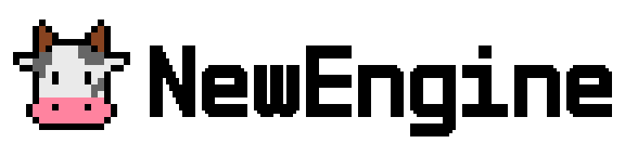
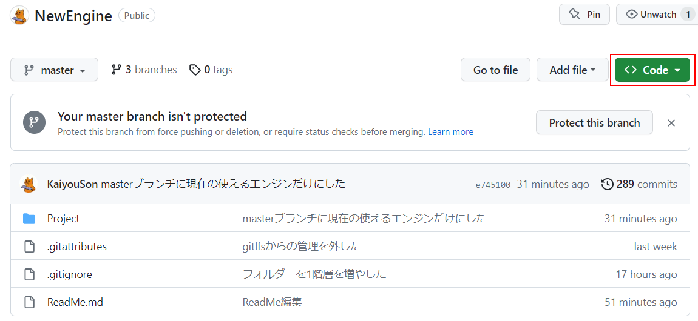
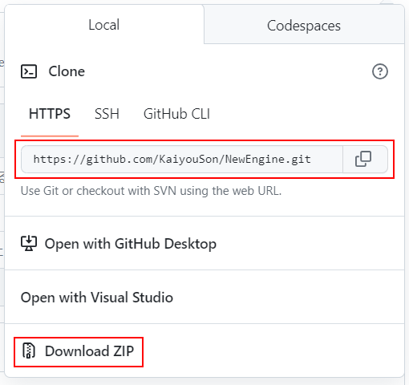

# NewEngine

## 2Dおよび3Dの自作ゲーム開発エンジン

ゲーム作成上での基本的な機能を持ち、
**[Dear ImGui](https://github.com/ocornut/imgui)**
**[Assimp](https://github.com/assimp/assimp)**
等のライブラリもエンジン内に取り組んでいます。

## ブランチ詳細
| ブランチ | 説明 |
|----------|------|
| **[NewEngine](https://github.com/KaiyouSon/NewEngine)** | 現状のエンジン |
| **[EngineProduction](https://github.com/KaiyouSon/NewEngine)** | エンジンの開発状況 |
| **[PersonalProduction](https://github.com/KaiyouSon/NewEngine)** | 個人製作の開発状況 |

## ビルド
**[NewEngine](https://github.com/KaiyouSon/NewEngine)** の 
Code から 
URLをコピーしてClong もしくは 
zipをダウンロード する

| Codeをクリック |
|:--------------:|
|  | 

| ClongもしくはDowload |
|:--------------------:|
|  |

## エンジンリファレンス

**[NewEngine リファレンス](https://scrapbox.io/NewEngineNV-Reference/NewEngine_-_Reference)**
作成中...